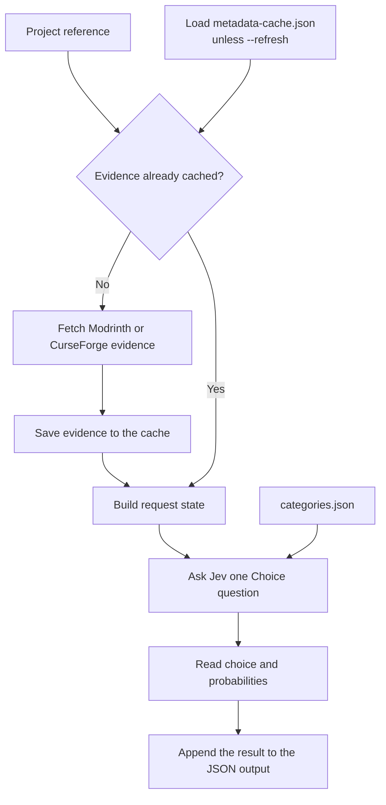

# Introduction

Modhopper sorts Minecraft mods into categories with Jev, TypeSafe's System One decision model.
It reads project information from Modrinth or CurseForge, the websites that host the mods.
It asks Jev to choose one category for each project.
It prints the results as JSON, a text format that other programs can read.

The diagram shows a successful classification.
Cache hits still call Jev.

Modhopper is a proof of concept.
It does not download or install mods.
It does not inspect mod files or check whether mods work together.
The result is a classification of the website's description, not a test of the mod.

You can use either implementation.
The Python version uses only Python's standard library.
The Rust version compiles to an executable and uses `ureq` for web requests and `serde_json` for JSON.
Both read the same `categories.json` and use the same Jev question.
Their output matches for the recorded examples.
The [comparison](python-versus-rust.md) explains their differences outside those examples.

Start with [Getting started](getting-started.md).
To try both versions without service credentials, run the [offline check](offline-check.md).
