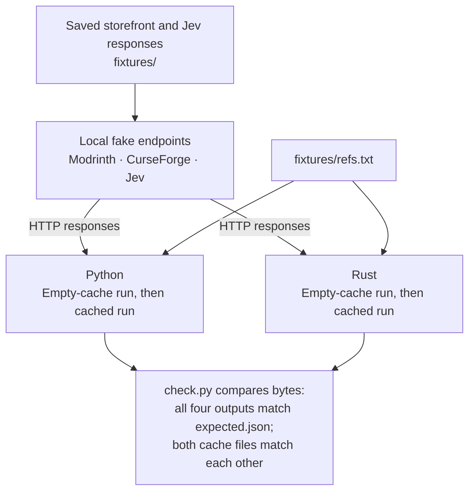

# Offline check

A fixture is a saved response used in place of a live service.
The repository includes storefront and Jev fixtures for four references.
You need Python 3 and Cargo to check both implementations:

```sh
python3 check.py
```

The classification requests stay on the local machine and need no real API keys.
Cargo may need internet access to download dependencies on the first build.
After those dependencies are available, require an offline Cargo build with:

```sh
CARGO_NET_OFFLINE=true python3 check.py
```

## What runs



`check.py` starts a local HTTP server on `127.0.0.1` with an available port.
It sets all three base URLs to that server for the child processes:

| Variable | Normal default | Check behavior |
| --- | --- | --- |
| `MODRINTH_BASE_URL` | `https://api.modrinth.com` | Serves `fixtures/modrinth/<identifier>.json` at `/v2/project/<identifier>`. |
| `CURSEFORGE_BASE_URL` | `https://api.curseforge.com` | Serves `fixtures/curseforge/<identifier>.json` at `/v1/mods/<identifier>`. |
| `TYPESAFE_BASE_URL` | `https://api.typesafe.ai` | Serves a recorded answer at `/v1/systemone`. |

The first two variables exist for this check, rather than as normal setup steps.
The check removes `TYPESAFE_API_KEY` from the child environment.
It uses a dummy CurseForge credential and requires the corresponding `x-api-key` header.
It never needs your service credentials.

For each Jev request, the server asserts that `questions.category.criteria` equals the current `categories.json`.
It selects the saved answer by `state.name` from `fixtures/jev/answers.json`.
It does not evaluate the evidence or call a model.
It does not validate every request field.

Next, the check builds Rust with `cargo build -q --manifest-path rust/Cargo.toml`.
It runs Python and the Rust development executable with `--file fixtures/refs.txt`.
Each gets a separate temporary cache.
It runs both again with those same caches, then compares the cache files.
Finally, it requires all four standard-output byte streams to equal `fixtures/expected.json`.
That includes spacing, key order, and the final newline.

The second runs exercise cache reuse, but the server remains available.
The check does not assert that these runs made zero storefront requests.
It does not test `--refresh` or the [documented divergences](python-versus-rust.md#behavioral-differences).

## Add a fixture

1. Add one reference to `fixtures/refs.txt`. Its position determines its output position. Use a project name not already in the Jev fixture map, unless it should share that same answer.
2. Save the corresponding project response under `fixtures/modrinth/<identifier>.json` or `fixtures/curseforge/<identifier>.json`. A CurseForge fixture must include the outer `data` object. Follow the existing files for the fields the fetchers read. Do not save credentials or headers.
3. Add an entry to `fixtures/jev/answers.json`, keyed by the exact Modrinth `title` or CurseForge `data.name`. Put the full response under that key. Its `answers.category` needs a valid `choice` and numeric `probabilities`. Include the chosen label and at least one other label. Use labels from `categories.json`.
4. Add the expected result to `fixtures/expected.json` in reference order. Follow the existing objects for the six output fields. Use two-space indentation, sorted object keys, unescaped Unicode, and a trailing newline. Check the rounded percentages and alphabetical tie-breaking against [answer parsing](questions-and-state.md#parse-the-answer).
5. Run `python3 check.py`. Review any output mismatch before changing the expected result. Require a successful exit after all four runs.

The fake server returns what the fixture says.
Passing this check proves consistency with those saved expectations, not that the categories are correct for a live project.

## Build this documentation

The site uses [mdBook](https://rust-lang.github.io/mdBook/), a tool that builds a book from Markdown text files.
Install the pinned version and build from the repository root:

```sh
cargo install mdbook --version 0.5.4 --locked
mdbook build docs
```

Open `docs/book/index.html`, or preview the book with:

```sh
mdbook serve docs --open
```

The diagrams use [Mermaid](https://mermaid.js.org/), which turns text definitions into diagrams.
`docs/theme/mermaid.js` loads version 11.15.0 from jsDelivr through mdBook's `additional-js` setting.
The browser needs internet access to load that script.
If it cannot load, the diagram definitions remain readable as text.

The workflow in `.github/workflows/docs.yml` builds pull requests without publishing them.
Every push to `main` builds and deploys the site through GitHub Actions, GitHub's automated workflow service.
The repository's Pages source is GitHub Actions.
The published address is <https://gorpokki.github.io/modhopper/>.
