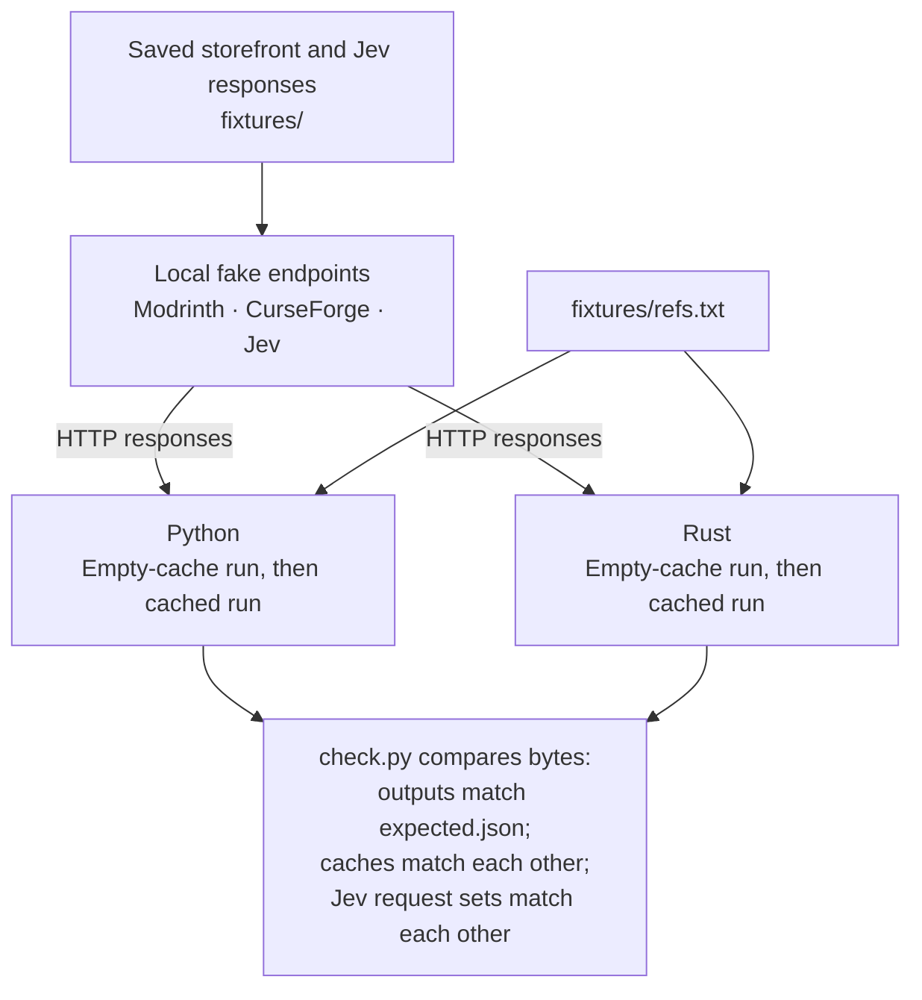

# Offline check

A fixture is a saved response used in place of a live service.
The repository includes 164 recorded Modrinth projects and one hand-written CurseForge project, JourneyMap.
All 165 projects have recorded live Jev answers.
You need Python 3.8 or newer and Cargo to check both implementations:

```sh
python3 check.py
```

The classification requests stay on the local machine and need no real API keys.
Cargo may need internet access to download dependencies on the first build.
After those dependencies are available, require an offline Cargo build with:

```sh
CARGO_NET_OFFLINE=true python3 check.py
```

## What runs



`check.py` starts a local HTTP server on `127.0.0.1` with an available port.
It sets all three base URLs to that server for the child processes:

| Variable | Normal default | Check behavior |
| --- | --- | --- |
| `MODRINTH_BASE_URL` | `https://api.modrinth.com` | Serves `fixtures/modrinth/<identifier>.json` at `/v2/project/<identifier>`. |
| `CURSEFORGE_BASE_URL` | `https://api.curseforge.com` | Serves `fixtures/curseforge/<identifier>.json` at `/v1/mods/<identifier>`. |
| `TYPESAFE_BASE_URL` | `https://api.typesafe.ai` | Serves a recorded answer at `/v1/systemone`. |

The first two variables exist for this check, rather than as normal setup steps.
The check removes `TYPESAFE_API_KEY` from the child environment.
It uses a dummy CurseForge credential and requires the corresponding `x-api-key` header.
It never needs your service credentials.

For each Jev request, the server asserts that `questions.category.criteria` equals the current `categories.json`.
It returns HTTP `500` if they differ.
It selects the saved answer by `state.name` from `fixtures/jev/answers.json`.
It does not evaluate the evidence or call a model.
It does not validate every request field.

Next, the check builds Rust with `cargo build -q --locked --manifest-path rust/Cargo.toml`.
It runs Python and the Rust development executable with `--file fixtures/refs.txt`.
Each gets a separate temporary cache.
It runs both again with those same caches, then compares the cache files.
It also compares the sets of raw Jev request bodies from all four runs.
No JSON normalization hides differences in key order, spacing, or text escaping.
Finally, it requires all four standard-output byte streams to equal `fixtures/expected.json`.
That includes spacing, key order, and the final newline.
If a command fails, the check prints its exit status and standard error.

The second runs exercise cache reuse, but the server remains available.
The check does not assert that these runs made zero storefront requests.
The request comparison uses sets, so it does not check request order or repeated-request counts.
The check does not run the HTTP failure cases or test `--refresh`.

## Fixture files

| File | What it contains |
| --- | --- |
| `fixtures/modrinth/<slug>.json` | Selected fields from one live Modrinth project response. There are currently 164 files. |
| `fixtures/curseforge/32274.json` | A hand-written JourneyMap response in the official CurseForge shape. It does not prove live CurseForge access. |
| `fixtures/jev/answers.json` | The recorded Jev response for each project, keyed by its name. |
| `fixtures/refs.txt` | The 165 references, in output order. |
| `fixtures/expected.json` | The Python output from the same recording run. |

The sample spans performance, visuals, animations, utilities, gameplay, libraries, world generation, and server tools.
It is a collection of popular projects, not a random or complete sample of either storefront.

## Record new responses

`fixtures/record.py` makes live Modrinth and Jev requests.
Set up [Jev access](jev.md) first.
It does not need a CurseForge key because it reuses the stored CurseForge response.

**This command replaces the Modrinth fixture files and rewrites the reference list, recorded Jev answers, and expected output. Preserve any uncommitted fixture edits before running it. A failed run can leave partially replaced fixtures; it does not roll back its writes.**

```sh
python3 fixtures/record.py --per-bucket 15
python3 check.py
git diff --stat -- fixtures
```

`--per-bucket` defaults to `15`.
It limits search hits per bucket, not the final number of projects.
The recorder queries Modrinth's search API by category or text query, ordered by downloads.
It avoids previously selected project IDs and titles and excludes a small fixed list.
It fetches project details in batches of up to 50 through `/v2/projects`, then writes files in slug order.
It uses the public Modrinth endpoint directly, regardless of `MODRINTH_BASE_URL`.

The recorder keeps the project ID, slug, type, title, summary, body, and category fields.
It appends the existing CurseForge references and rejects duplicate project names before recording answers.
It then starts a local server for these storefront fixtures and runs the Python classifier.
The server forwards Jev requests to `TYPESAFE_BASE_URL`, which defaults to the public TypeSafe endpoint.
It saves one answer per name and serves that same saved answer to the classifier.
Thus `answers.json` and `expected.json` describe the same run.

The recorder redacts strings that match its credential patterns in stored evidence and answers.
Review the resulting files before committing them; pattern matching is not a complete secret check.
Its Jev forwarding refuses redirects and uses a 120-second Python timeout.
The recorder is separate from the classifier's three-attempt retry loop.
The same search can select different projects later, and live Jev answers can change.

## Add a fixture

1. Add one reference to `fixtures/refs.txt`. Its position determines its output position. Use a unique project name: the recorder rejects duplicate names, and the replay server selects answers by name.
2. Save the corresponding project response under `fixtures/modrinth/<identifier>.json` or `fixtures/curseforge/<identifier>.json`. A CurseForge fixture must include the outer `data` object. Follow the existing files for the fields the fetchers read. Do not save credentials or headers.
3. Add an entry to `fixtures/jev/answers.json`, keyed by the exact Modrinth `title` or CurseForge `data.name`. Put the full response under that key. Its `answers.category` needs a valid `choice` and numeric `probabilities`. Include the chosen label and at least one other label. Use labels from `categories.json`.
4. Add the expected result to `fixtures/expected.json` in reference order. Follow the existing objects for the six output fields. Use two-space indentation, sorted object keys, unescaped Unicode, and a trailing newline. Check the rounded percentages and alphabetical tie-breaking against [answer parsing](questions-and-state.md#parse-the-answer).
5. Run `python3 check.py`. Review any output mismatch before changing the expected result. Require a successful exit after all four runs.

The fake server returns what the fixture says.
Passing this check proves consistency with those saved expectations, not that the categories are correct for a live project.

## Continuous integration

Continuous integration (CI) means running automated checks when code changes.
`.github/workflows/check.yml` runs `python3 check.py` on every push and pull request.
It uses Ubuntu, stable Rust, and a 15-minute job limit.
It needs no service credentials and does not re-record fixtures.
A push to a branch with an open pull request can trigger both events.

## Build this documentation

The site uses [mdBook](https://rust-lang.github.io/mdBook/), a tool that builds a book from Markdown text files.
Install the pinned version and build from the repository root:

```sh
cargo install mdbook --version 0.5.4 --locked
mdbook build docs
```

Open `docs/book/index.html`, or preview the book with:

```sh
mdbook serve docs --open
```

The diagrams use [Mermaid](https://mermaid.js.org/), which turns text definitions into diagrams.
`docs/theme/mermaid.js` loads version 11.15.0 from jsDelivr through mdBook's `additional-js` setting.
The browser needs internet access to load that script.
If it cannot load, the diagram definitions remain readable as text.

The workflow in `.github/workflows/docs.yml` builds pull requests without publishing them.
Every push to `main` builds and deploys the site through GitHub Actions, GitHub's automated workflow service.
The repository's Pages source is GitHub Actions.
The published address is <https://gorpokki.github.io/modhopper/>.
